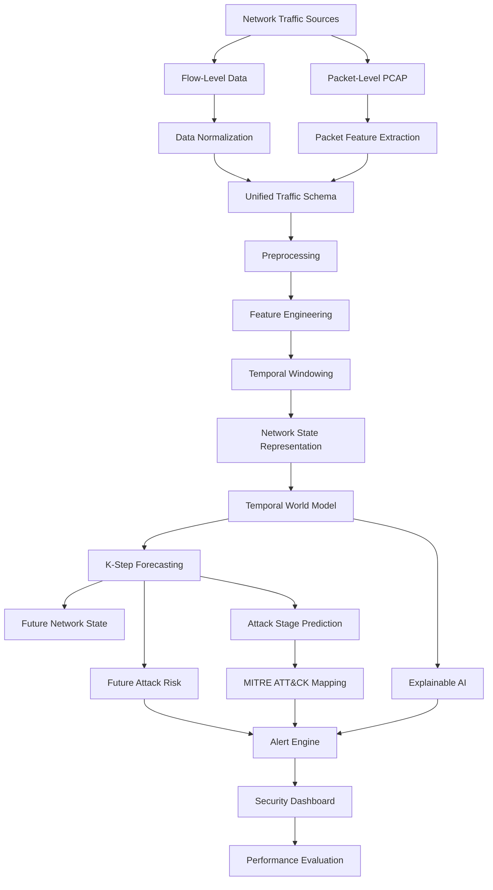
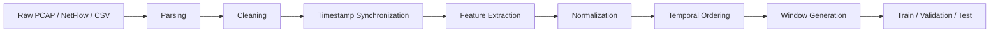
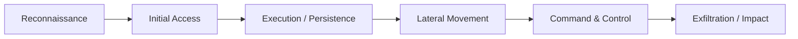
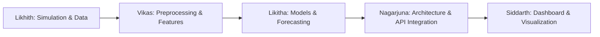

<div align="center">

# 🛡️ NetForecast AI

### AI-Based Network Attack Forecasting from Network Traffic Data

**From Reactive Detection to Predictive Network Security**

[](https://www.python.org/)
[](https://pytorch.org/)
[](https://scikit-learn.org/)
[](https://fastapi.tiangolo.com/)
[](https://streamlit.io/)
[](https://github.com/slundberg/shap)
[](https://git-scm.com/)
[](https://github.com/nagarjuna-32/cyber-network-traffic)
[](https://attack.mitre.org/)
[](#36-license)

<br/>

> **NetForecast AI** is a temporal AI framework designed to learn evolving network behavior and forecast future attack states before an attacker completes their objective.

</div>

---

## 📌 Project Status

The following matrix summarizes the development status of each core module:

| Component | Status | Notes |
| :--- | :---: | :--- |
| **Architecture** | 🟢 Designed | High-level data contracts, module boundaries, and interfaces specified |
| **Dataset Pipeline** | 🟡 In Development | Ingestion parsers for flow and packet records under construction |
| **Attack Simulation** | 🟡 In Development | Synthetic multi-stage campaign generation module being authored |
| **Preprocessing** | 🟡 In Development | Normalization, missing-value imputation, and chronological sorting |
| **Feature Engineering** | 🟡 In Development | Cyber-domain statistical and protocol flag ratio extraction |
| **Logistic Regression Baseline** | 🟡 In Development | Static reference classifier for empirical benchmarking |
| **Temporal AI Model** | 🟡 In Development | Recurrent and attention-based sequential modeling architectures |
| **K-Step Forecasting** | 🟡 In Development | Multi-horizon sequence extrapolation mechanics |
| **MITRE ATT&CK Mapping** | 🟡 In Development | Behavioral heuristic alignment with enterprise tactics/techniques |
| **Explainable AI** | 🟡 Planned / In Dev | Attribution mechanisms (SHAP, attention weights) |
| **Dashboard** | 🟡 In Development | Interactive visualization portal for telemetry and forecast monitoring |
| **Evaluation** | 🟡 Pending | Systematic experimentation across chronological splits |
| **Deployment** | ⚪ Planned | Containerized deployment and live tap integration |

*Status indicators: 🟢 Designed / Complete | 🟡 In Development | ⚪ Planned / Pending*

---

## 📑 Table of Contents

1. [Overview](#1-overview)
2. [Problem Statement](#2-problem-statement)
3. [Motivation](#3-motivation)
4. [Key Objectives](#4-key-objectives)
5. [Core Innovation](#5-core-innovation)
6. [System Architecture](#6-system-architecture)
7. [Data Sources](#7-data-sources)
8. [Datasets](#8-datasets)
9. [Data Pipeline](#9-data-pipeline)
10. [Feature Engineering](#10-feature-engineering)
11. [Temporal State Representation](#11-temporal-state-representation)
12. [World Model](#12-world-model)
13. [K-Step Forecasting](#13-k-step-forecasting)
14. [Attack Stage Prediction](#14-attack-stage-prediction)
15. [MITRE ATT&CK Mapping](#15-mitre-attck-mapping)
16. [Explainable AI](#16-explainable-ai)
17. [Early Warning Engine](#17-early-warning-engine)
18. [Security Dashboard](#18-security-dashboard)
19. [Baseline Model](#19-baseline-model)
20. [Evaluation](#20-evaluation)
21. [Experiment Design](#21-experiment-design)
22. [Technology Stack](#22-technology-stack)
23. [Repository Structure](#23-repository-structure)
24. [Integration Contracts](#24-integration-contracts)
25. [Team Responsibilities](#25-team-responsibilities)
26. [Installation](#26-installation)
27. [Usage](#27-usage)
28. [Configuration](#28-configuration)
29. [Example Workflow](#29-example-workflow)
30. [Research Methodology](#30-research-methodology)
31. [Limitations](#31-limitations)
32. [Future Work](#32-future-work)
33. [Roadmap](#33-roadmap)
34. [Contributing](#34-contributing)
35. [Ethics & Responsible Use](#35-ethics--responsible-use)
36. [License](#36-license)
37. [Acknowledgements](#37-acknowledgements)

---

## 1. Overview

Traditional Network Intrusion Detection Systems (NIDS) predominantly function as **reactive discriminators**: they ingest current packet or flow observations, evaluate static signatures or point-in-time anomalies, and determine whether the inspected traffic is malicious *right now*.

**NetForecast AI** reframes network intrusion management as a **temporal forecasting problem**. Rather than classifying isolated network transactions in a vacuum, the system models the continuous dynamics of network telemetry over time:

$$\textbf{Observe} \longrightarrow \textbf{Understand} \longrightarrow \textbf{Predict} \longrightarrow \textbf{Explain} \longrightarrow \textbf{Alert}$$

At time $t$, given an observed sequence of network states up to the present, the objective is to model the single-step transitional probability:

$$P(S_{t+1} \mid S_t)$$

and extrapolate across a multi-step forecasting horizon $K$:

$$P(S_{t+K} \mid S_t)$$

Where:
* $S_t$ denotes the structured representation of the network state at observation step $t$.
* $S_{t+K}$ denotes the predicted future network state at horizon $K$.
* $K$ represents the look-ahead forecasting horizon (number of future time steps or duration bins).

> [!NOTE]
> Network attack forecasting is an empirical research direction. The degree of forecast accuracy, early-warning lead time, and operational reliability is subject to rigorous experimental validation on benchmark datasets.

---

## 2. Problem Statement

Standard security monitoring infrastructure asks:

> *"Is this network connection or packet malicious right now?"*

This paradigm frequently alerts after an adversary has already obtained initial execution, established persistence, or begun data exfiltration. **NetForecast AI** investigates an alternative question:

> *"Given the observed sequence of network behavior up to time $t$, what security state and threat level is likely to transpire across steps $t+1, \dots, t+K$?"*

Complex cyber attacks do not manifest as isolated events; they unfold along an organized temporal progression:

```text
Reconnaissance
      ↓
Initial Access
      ↓
Execution / Persistence
      ↓
Lateral Movement
      ↓
Command & Control
      ↓
Exfiltration / Impact
```

During the formative phases (e.g., low-and-slow reconnaissance or credential probing), individual network flows may appear benign or ambiguous when viewed in isolation. Their hostile intent only becomes statistically discernable through their **temporal trajectory** across consecutive observation windows.

---

## 3. Motivation

1. **Adversaries Operate Sequentially**: Intrusions follow structured kill chains where earlier actions (probing, scanning) are precursors to high-impact exploitation.
2. **Dynamic Network Evolution**: Network behavior fluctuates across shifts, business hours, and operational cycles; static rules fail to capture non-stationary dynamics.
3. **Detection Delay**: Flagging an attack mid-exfiltration offers minimal reaction time; forecasting an attack during reconnaissance gives Security Operations Center (SOC) defenders crucial mitigation lead time.
4. **Complementary Granularity**: Combining flow-level macroscopic trends with packet-level microscopic signatures provides a multi-resolution picture of network health.

### Comparison: Traditional NIDS vs. NetForecast AI

| Dimension | Traditional Intrusion Detection | NetForecast AI (Proposed) |
| :--- | :--- | :--- |
| **Inference Target** | Current-state classification ($t$) | Future-state forecasting ($t+K$) |
| **Input Structure** | Individual or aggregated flow records | Continuous temporal sequence $[S_{t-T}, \dots, S_t]$ |
| **Decision Output** | Binary `Attack` vs. `Normal` | Future state vector, threat probability & risk timeline |
| **Actionability** | Reactive alert after observation | Proactive early warning prior to compromise |
| **Temporal Context** | Limited / Memoryless | Explicit temporal sequence modeling |
| **Forecasting Horizon** | None ($K = 0$) | Configurable $K$-step ahead projection |

*Note: This comparison outlines architectural design differences. Empirical performance advantages must be established through experimental benchmarks.*

---

## 4. Key Objectives

1. Ingest both **flow-level** records and **packet-level** network traces.
2. Parse, synchronize, and clean multi-source telemetry data without introducing temporal look-ahead bias.
3. Extract cyber-domain statistical, protocol flag, timing, and behavioral features.
4. Formulate sequential **temporal network state vectors** ($S_t$).
5. Train a **temporal AI architecture** capable of learning sequential network transitions.
6. Forecast network states across a defined horizon of **$K$ time steps**.
7. Estimate the probabilistic risk of impending attack or network compromise.
8. Map predicted anomalous sequences to tactical **MITRE ATT&CK** classifications.
9. Provide feature attribution using **Explainable AI** (SHAP and attention diagnostics).
10. Generate calibrated, actionable **early-warning alerts**.
11. Build an interactive **security dashboard** for SOC visualization.
12. Rigorously evaluate the temporal system against a standard **Logistic Regression baseline**.

---

## 5. Core Innovation

Traditional machine learning classifiers evaluate an isolated flow or fixed aggregated summary to emit a point-in-time verdict. NetForecast AI models the underlying sequential process using a state-transition paradigm:

```text
Traditional Machine Learning IDS

     Network Traffic Record
               ↓
       Feature Extraction
               ↓
        Static Classifier
               ↓
        [ Attack / Normal ]
```

$$\text{vs.}$$

```text
NetForecast AI Temporal Framework

     Sequential Traffic Telemetry
                  ↓
      Temporal State Vectors (S_t)
                  ↓
       Network World Model
                  ↓
    Future Sequence Simulation
                  ↓
         K-Step Forecast
                  ↓
     Future Attack Probability
                  ↓
      MITRE ATT&CK Mapping
                  ↓
     Explainable Early Alert
```

The core research direction is **temporal network security forecasting**: leveraging sequence models as generative or predictive world models that anticipate how network sessions evolve over time.

---

## 6. System Architecture

The end-to-end data processing, modeling, and presentation flow is depicted below:



---

## 7. Data Sources

NetForecast AI is architected to synthesize signals across two complementary observation granularities:

### Flow-Level Data (Macroscopic Visibility)
* **Sources**: NetFlow (v5/v9), IPFIX, Argus, Zeek `conn.log`
* **Characteristics**: Session-level summaries describing connection longevity, volume, and socket endpoints.
* **Key Fields**: Source IP/port, destination IP/port, transport protocol, flow duration, cumulative forward/backward packets, cumulative forward/backward bytes, TCP flag assertions.
* **Role**: Captures high-volume, enterprise-wide communications with minimal processing overhead.

### Packet-Level Data (Microscopic Visibility)
* **Sources**: PCAP, PCAPNG interfaces (raw packet capture)
* **Characteristics**: Fine-grained, individual frame inspection.
* **Key Fields**: Packet length distributions, Time-to-Live (TTL) variance, TCP sliding window sizes, inter-arrival time (IAT), sequence/acknowledgment numbers, payload entropy.
* **Role**: Exposes low-level transport anomalies and evasion techniques obscured by flow aggregation.

$$\textbf{Flow-Level} = \text{Macroscopic enterprise traffic patterns} \quad\big|\quad \textbf{Packet-Level} = \text{Microscopic protocol mechanics}$$

---

## 8. Datasets

The framework is planned for evaluation against standardized public intrusion benchmarks:

* **CIC-IDS2018 (CSE-CIC-IDS2018)**: Extensive enterprise network capture incorporating realistic benign background traffic alongside multi-day attack scenarios (Brute Force, DoS/DDoS, Botnet, Infiltration).
* **CTU-13**: Real-world Botnet traffic mixed with normal network communications, providing annotated NetFlow traces.
* **Alternative Candidates**: UNSW-NB15, TON_IoT, or custom synthetic traces generated via our attack simulator.

### Dataset Selection Criteria

Candidate datasets are evaluated according to the following operational criteria:
1. **Temporal Fidelity**: Continuous, monotonically increasing timestamps without synthetic chronological shuffling.
2. **Attack Multi-Stagedness**: Inclusion of phased adversary behaviors (scanning followed by exploitation).
3. **Dual Representation**: Availability of raw PCAPs alongside parsed flow records.
4. **Label Integrity**: Granular, flow-level labeling separating benign baseline from specific attack phases.
5. **Licensing**: Permissive academic and open-source usage terms.

---

## 9. Data Pipeline

Data processing must preserve temporal ordering strictly to prevent **look-ahead bias** and data leakage:



### Prevention of Temporal Leakage
* **Strict Chronological Splitting**: Train, validation, and test partitions are divided by timestamp boundaries (e.g., first 70% time, middle 15%, final 15%). Random shuffling is strictly prohibited.
* **Pipeline State Fitting**: Normalization parameters (mean, standard deviation, min/max) are fit exclusively on the training partition and applied identically to validation and test sets.

---

## 10. Feature Engineering

Features are computed over rolling intervals or aggregated flow records across distinct analytical categories:

| Category | Description | Example Features |
| :--- | :--- | :--- |
| **Network** | Endpoint identification & topology | Source/destination IP categorization, port numbers, internal-to-internal flags |
| **Traffic** | Communication volume & bandwidth | Total forward bytes, total backward bytes, packet counts, byte asymmetry ratio |
| **TCP Flags** | Transport state machine indicators | SYN count, ACK count, FIN count, RST count, SYN-to-ACK ratio |
| **Timing** | Temporal dynamics & pacing | Inter-arrival time (mean/variance), connection duration, burst frequency |
| **Packet** | Protocol header attributes | Time-to-Live (TTL), packet length variance, TCP window advertised size |
| **Statistical** | Aggregate rate measures | Flow packet rate (pkts/sec), flow byte rate (bytes/sec), rolling moving averages |
| **Behavioral** | Scan and sweep indicators | Destination port entropy, unique destination IP ratio per source host |

*The exact feature subset will be finalized during empirical feature selection experiments.*

---

## 11. Temporal State Representation

Rather than feeding isolated packet vectors directly into an inferential model:

$$\text{Packet}_t \longrightarrow \text{Classification}$$

NetForecast AI aggregates features into structured **state vectors** representing consecutive time intervals:

$$S_{t-3} \longrightarrow S_{t-2} \longrightarrow S_{t-1} \longrightarrow S_t$$

### Windowing Parameters
* **Window Size ($W$)**: Time duration or packet count aggregated into a single state vector $S_t$ (e.g., 5 seconds or 100 flows).
* **Step Size / Stride**: Interval between consecutive window starts.
* **Sequence Length ($T$)**: Number of consecutive past states fed into the temporal model ($[S_{t-T+1}, \dots, S_t]$).
* **Forecast Horizon ($K$)**: Number of time steps into the future that the system aims to project ($S_{t+K}$).

---

## 12. World Model

In the context of NetForecast AI, a **World Model** is a temporal representation that approximates the transition dynamics of a monitored network environment:

```text
Current State Vector (S_t)
            ↓
  Learned Network Dynamics
            ↓
Future State Distribution P(S_t+1 | S_t)
```

Mathematically, the network state transition is modeled as:

$$S_{t+1} \sim P(S_{t+1} \mid S_t, S_{t-1}, \dots, S_{t-T+1})$$

and extrapolated across multiple future steps:

$$P(S_{t+K} \mid S_{\le t})$$

### Architectural Candidates
* **Recurrent Architectures (LSTM / GRU)**: Explicit hidden states capturing sequential transitions.
* **Time-Series Transformers**: Multi-head self-attention mechanisms modeling long-range temporal dependencies.
* **Graph Neural Network (GNN) Extensions**: Combining spatial network topology with temporal state propagation (planned extension).

---

## 13. K-Step Forecasting

Multi-step ahead projection unfolds recursively or via direct sequence-to-sequence generation:

```text
S_t (Current Observed State)
 │
 ├──▶ S_t+1 (Projected Next State)
 │
 ├──▶ S_t+2 (Projected Mid-Horizon)
 │
 └──▶ S_t+K (Projected Full Horizon)
```

### Forecasting Outputs
For each forecast step $k \in \{1, \dots, K\}$, the model emits:
1. **Future State Vector ($\hat{S}_{t+k}$)**: Predicted network statistical features.
2. **Future Attack Probability ($p_{t+k}$)**: Calibrated likelihood that malicious behavior manifests at step $t+k$.
3. **Predicted Attack Stage**: Categorization of expected adversary activity.
4. **Forecast Confidence**: Uncertainty estimate associated with the projection.

---

## 14. Attack Stage Prediction

NetForecast AI correlates predicted temporal patterns with typical stages of adversary intrusion:



> [!IMPORTANT]
> Attack-stage prediction represents an algorithmic inference based on learned statistical signals (e.g., port sweep velocity, repeated authentication failures). It provides probabilistic guidance for security analysts rather than definitive forensic proof.

---

## 15. MITRE ATT&CK Mapping

Predicted behavior sequences are mapped to official MITRE ATT&CK Enterprise tactics and techniques:

| Observable Network Precursor | Potential ATT&CK Context | Technique ID |
| :--- | :--- | :---: |
| High-velocity port sweeping across subnet | Reconnaissance / Network Service Discovery | `T1046` |
| Bursts of failed authentication handshakes | Initial Access / Credential Access (Brute Force) | `T1110` |
| Anomalous internal SMB/RDP session initiation | Lateral Movement / Remote Services | `T1021` |
| Periodic outbound beaconing to unclassified IP | Command and Control / Application Layer Protocol | `T1071` |
| Asymmetric, sustained outbound data transfer | Exfiltration / Exfiltration Over Alternative Protocol | `T1048` |

*Disclaimer: Alignment with MITRE ATT&CK provides tactical context for alert triage. It does not replace formal incident investigation.*

---

## 16. Explainable AI

Explainability is essential to ensure security analysts understand and trust automated predictive warnings.

### SHAP (SHapley Additive exPlanations)
Used to compute local feature attributions, quantifying how individual network signals (e.g., SYN rate, port diversity) shift the predicted threat probability away from baseline expectation.

### Attention Visualization
For Transformer implementations, temporal attention weights across input sequence steps $[t-T, \dots, t]$ highlight which prior time windows influenced the future forecast.

```text
Prediction Output: ELEVATED ATTACK RISK (P = 0.84, Horizon K = +5)

Top Contributing Feature Signals:
████████████████████  SYN-to-ACK Ratio Spikes (+0.34)
███████████████       Destination Port Diversity (+0.26)
██████████            Failed Handshake Frequency (+0.18)
██████                Outbound Byte Rate Acceleration (+0.11)
██                    Packet Inter-Arrival Variance (-0.05)
```

---

## 17. Early Warning Engine

The alert engine translates raw model outputs into structured security events:

```text
Model Output (P, S_t+K)
          ↓
Risk Scoring & Calibration
          ↓
Configurable Decision Thresholds
          ↓
Structured Alert Generation
```

### Alert Record Schema
* `timestamp`: ISO-8601 generation time
* `forecast_horizon`: Look-ahead steps ($K$)
* `risk_score`: Calibrated probability $[0.0, 1.0]$
* `predicted_stage`: Inferred attack phase
* `confidence`: Model certainty interval
* `contributing_features`: Top SHAP attribution signals
* `evidence_window`: Historical timestamps $[t-T, t]$ supporting the alert

---

## 18. Security Dashboard

The presentation layer provides security analysts with an operational interface for threat monitoring:

* **Current Network Status**: Live telemetry throughput, active sessions, and baseline metrics.
* **Predictive Threat Timeline**: Continuous graph displaying projected risk across future horizons $t+1 \dots t+K$.
* **MITRE ATT&CK Matrix Overlay**: Active highlighting of forecasted adversary tactics.
* **Feature Attribution Panel**: Dynamic SHAP bar charts explaining alert rationale.
* **Alert Feed**: Triage queue of generated early warnings.

*Implementation: Authored using **Streamlit** (with alternative API endpoints via **FastAPI**). Early prototypes may operate on synthetic or offline replayed telemetry.*

---

## 19. Baseline Model

To rigorously validate whether temporal sequence modeling provides measurable benefits over conventional static methods, NetForecast AI includes a **Logistic Regression Baseline**:

```text
Current Feature Snapshot (S_t)
              ↓
  L2-Regularized Logistic Regression
              ↓
      [ Attack / Normal ]
```

### Benchmark Purpose
* Acts as an interpretable, computationally lightweight reference.
* Verifies whether sequence models justify their computational overhead through superior precision, recall, or warning lead time.
* No claims of superiority are made prior to empirical benchmarking on identical chronological test sets.

---

## 20. Evaluation

### Target Metrics
* **Precision, Recall, F1-Score**: Evaluated at various decision thresholds.
* **False Positive Rate (FPR)**: Critical for minimizing SOC alert fatigue.
* **AUROC & AUPRC**: Area under ROC and Precision-Recall curves.
* **Forecast Lead Time**: Timesteps between early warning generation and attack manifestation.
* **Brier Score / Calibration Error**: Reliability of probabilistic risk outputs.

### Benchmark Results Table

| Metric | Logistic Regression Baseline | Temporal Sequence Model |
| :--- | :---: | :---: |
| **Precision** | *TBD* | *TBD* |
| **Recall** | *TBD* | *TBD* |
| **F1-Score** | *TBD* | *TBD* |
| **False Positive Rate (FPR)** | *TBD* | *TBD* |
| **AUROC** | *TBD* | *TBD* |
| **Mean Lead Time ($K$ steps)** | *TBD* | *TBD* |

> [!NOTE]
> Experimental values will be populated following formal model training and evaluation across frozen benchmark test sets.

---

## 21. Experiment Design

To ensure scientific rigor and reproducibility, experiments follow a controlled lifecycle:

```text
Chronological Data Stream
            ↓
  Partition: Train (70%)  ──▶ Fit Preprocessing & Scalers
            ↓
  Partition: Validation (15%) ──▶ Hyperparameter Optimization
            ↓
  Partition: Frozen Test (15%) ──▶ Final Unbiased Evaluation
```

* **Zero Leakage**: Temporal ordering is strictly preserved.
* **Class Imbalance Mitigation**: Weighted cross-entropy and focal loss formulations.
* **Multiple Horizons**: Evaluation across short ($K=1$), medium ($K=5$), and long ($K=15$) horizons.
* **Multi-Seed Runs**: Reporting mean and standard deviation across repeated random initializations.

---

## 22. Technology Stack

| Layer | Component | Technologies |
| :--- | :--- | :--- |
| **Language** | Core Runtime | Python 3.10+ |
| **Data Processing** | Tabular & Numerical | Pandas, NumPy, SciPy |
| **Network Analysis** | Packet/Flow Parsing | Scapy, Zeek parsers (or CSV exporters) |
| **Machine Learning** | Baseline & Metrics | Scikit-Learn |
| **Deep Learning** | Temporal Models | PyTorch |
| **Explainability** | Feature Attribution | SHAP (SHapley Additive exPlanations) |
| **API Layer** | Serving Engine | FastAPI, Uvicorn |
| **Visualization** | Security Dashboard | Streamlit |
| **Threat Intelligence**| Security Ontology | MITRE ATT&CK Enterprise Matrix |
| **Version Control** | Collaboration | Git, GitHub |

---

## 23. Repository Structure

```text
network-attack-forecasting/
│
├── README.md                  # Project overview and research documentation
├── requirements.txt           # Python dependency specifications
├── .gitignore                 # Version control exclusions
│
├── data/
│   ├── raw/                   # Raw PCAP / NetFlow captures (e.g. CICIDS)
│   ├── processed/             # Scaled and normalized feature tensors
│   └── simulated/             # Synthetic multi-stage attack traces
│
├── dataset/
│   └── README.md              # Dataset ingestion specifications and guides
│
├── preprocessing/
│   ├── clean.py               # Data sanitization, IP parsing, normalization
│   ├── feature_extraction.py  # Domain cyber signals (SYN/ACK ratio, entropy)
│   └── windowing.py           # Temporal sliding window generator
│
├── models/
│   ├── baseline/
│   │   └── logistic_regression.py  # L2-Regularized baseline forecaster
│   └── temporal/
│       ├── lstm.py            # Temporal LSTM with Attention
│       └── transformer.py     # Time-Series Transformer Forecaster
│
├── simulation/
│   └── attack_simulator.py    # Multi-stage cyber campaign simulator
│
├── evaluation/
│   ├── metrics.py             # AUROC, F1, and Lead Time evaluation
│   └── compare_models.py      # Benchmark comparison runner
│
├── explainability/
│   └── shap_analysis.py       # SHAP and feature attribution module
│
├── mitre/
│   └── attack_mapping.py      # MITRE ATT&CK alignment and playbooks
│
├── api/
│   └── app.py                 # FastAPI REST serving backend
│
├── dashboard/
│   └── app.py                 # Interactive Streamlit SOC portal
│
├── configs/
│   └── config.yaml            # Central hyperparameter and path configuration
│
├── docs/
│   ├── architecture.md        # Technical pipeline architecture
│   ├── data_contract.md       # Ingestion schema contracts
│   └── model_contract.md      # Model SLAs and acceptance criteria
│
└── tests/                     # Unit and integration test suites
```

---

## 24. Integration Contracts

To enable modular multi-developer collaboration, data flowing between components adheres to strict interface contracts:

```text
Raw Dataset ──▶ [Data Contract] ──▶ Preprocessing
                                           ↓
                                   [Feature Contract]
                                           ↓
                                    Temporal Model
                                           ↓
                                [Model Output Contract]
                                           ↓
                                    API & Dashboard
```

### Example Model Output Schema (JSON)
*The following listing illustrates the intended schema for inferential responses:*

```json
{
  "timestamp": "2026-10-02T10:05:00Z",
  "forecast_horizon_steps": 5,
  "risk_score": 0.84,
  "predicted_state": "ELEVATED_RISK",
  "attack_stage": "INITIAL_ACCESS",
  "confidence": 0.91,
  "mitre_mapping": {
    "technique_id": "T1110",
    "technique_name": "Brute Force",
    "tactic": "Credential Access"
  },
  "top_attributions": [
    {"feature": "syn_to_ack_ratio", "impact": 0.34},
    {"feature": "failed_conn_ratio", "impact": 0.26}
  ]
}
```

---

## 25. Team Responsibilities

| Contributor | Focus Area | Primary Responsibilities |
| :--- | :--- | :--- |
| **Likhith** | Dataset & Attack Simulation | Dataset acquisition, schema verification, multi-stage attack flow simulation |
| **Vikas** | Preprocessing & Feature Engineering | Missing value handling, scaling, cyber feature extraction, temporal windowing |
| **Likitha** | Baseline & Temporal AI Models | Logistic regression baseline, LSTM / Transformer sequence architectures |
| **Siddarth** | Dashboard & Visualization | Streamlit SOC dashboard, real-time threat graphs, alert presentation |
| **Nagarjuna** | Architecture & Integration | System design, repository management, API design, contract enforcement |



---

## 26. Installation

### 1. Clone the Repository
```bash
git clone https://github.com/nagarjuna-32/cyber-network-traffic.git
cd cyber-network-traffic/network-attack-forecasting
```

### 2. Set Up Virtual Environment
```bash
python -m venv .venv
```

* Activate on Windows:
```bash
.venv\Scripts\activate
```

* Activate on Linux/macOS:
```bash
source .venv/bin/activate
```

### 3. Install Dependencies
```bash
pip install -r requirements.txt
```

---

## 27. Usage

*Commands below demonstrate anticipated entry points. Subcommand arguments may adapt as development proceeds.*

### 1. Run Data Cleaning & Feature Extraction
```bash
python preprocessing/clean.py data/raw/input_flows.csv data/processed/cleaned.csv
```

### 2. Execute Attack Simulation
```bash
python simulation/attack_simulator.py --duration 20 --output data/simulated/attack_trace.csv
```

### 3. Train Baseline Logistic Regression
```bash
python models/baseline/logistic_regression.py
```

### 4. Train Temporal AI Forecaster
```bash
python models/temporal/lstm.py
```

### 5. Launch FastAPI REST Engine
```bash
uvicorn api.app:app --host 0.0.0.0 --port 8000 --reload
```

### 6. Launch Security Dashboard
```bash
streamlit run dashboard/app.py
```

---

## 28. Configuration

Central parameters are configured via `configs/config.yaml`:

```yaml
project:
  name: "netforecast-ai"
  random_seed: 42

windowing:
  sequence_length: 20       # History length (T time steps)
  forecast_horizon: 5       # Future look-ahead (K time steps)
  stride: 1                 # Window slide step

model:
  learning_rate: 0.001
  batch_size: 64
  epochs: 20
  dropout: 0.2

thresholds:
  elevated_risk: 0.50
  critical_risk: 0.80

paths:
  raw_data: "data/raw"
  processed_data: "data/processed"
  checkpoints: "checkpoints"
```

---

## 29. Example Workflow

```text
Raw PCAP / Flow Telemetry
           ↓
Packet & Flow Parsing
           ↓
Domain Feature Extraction (SYN/ACK, Byte Asymmetry)
           ↓
Temporal Window Slicing (S_t-T ... S_t)
           ↓
Temporal State Representation
           ↓
Temporal Model Inference (LSTM / Transformer)
           ↓
K-Step Ahead State & Risk Forecast
           ↓
MITRE ATT&CK Tactic Correlation
           ↓
Explainable Attribution (SHAP)
           ↓
SOC Dashboard Alert Dispatch
```

---

## 30. Research Methodology

```text
Phase 1:  Literature Review & Formal Problem Formulation
Phase 2:  Dataset Ingestion & Quality Validation
Phase 3:  Robust Preprocessing Pipeline Construction
Phase 4:  Domain Feature Engineering & Entropy Measurement
Phase 5:  Static Baseline Development (Logistic Regression)
Phase 6:  Temporal Model Prototyping (LSTM & Transformer)
Phase 7:  Multi-Step Forecasting Horizon Experiments
Phase 8:  Explainability Integration (SHAP & Attention)
Phase 9:  Interactive SOC Dashboard & API Development
Phase 10: Quantitative Benchmarking on Frozen Test Sets
Phase 11: Technical Documentation & Research Dissemination
```

---

## 31. Limitations

1. **Benchmark Domain Shifts**: Public datasets (e.g., CICIDS) may not fully reflect modern encrypted cloud network architectures.
2. **Label Uncertainty**: Real-world telemetry labels can contain boundary noise or imperfect attack start/end demarcations.
3. **Horizon Decay**: Forecast uncertainty inherently increases as the forecasting horizon $K$ expands.
4. **Severe Class Imbalance**: In legitimate networks, attack flows represent a tiny fraction of total volume, risking false alarms.
5. **Computational Footprint**: High-throughput packet-level inspection requires substantial processing resources.
6. **Probabilistic Nature**: Forecasts represent statistical projections; they must inform, rather than replace, human security oversight.

---

## 32. Future Work

* **Graph Neural Networks (GNNs)**: Modeling host interactions as dynamic graph topologies alongside temporal sequence models.
* **Probabilistic Forecasting**: Emitting full predictive distributions rather than point predictions.
* **Streaming Inference**: Integration with real-time Kafka or eBPF network taps for line-rate evaluation.
* **Federated Learning**: Collaborative multi-organization threat forecasting without sharing raw payload data.
* **Adversarial Robustness**: Testing resilience against evasion attacks designed to defeat temporal sequence models.

---

## 33. Roadmap

- [x] High-level system architecture and mathematical framing
- [x] Repository modularization and interface contracts
- [ ] Benchmark dataset selection and ingestion pipeline
- [ ] Feature extraction and temporal window generator
- [ ] Logistic regression baseline implementation
- [ ] Temporal sequence model (LSTM / Transformer) training
- [ ] Multi-step ($K$-step) forecasting verification
- [ ] MITRE ATT&CK mapping integration
- [ ] SHAP feature attribution implementation
- [ ] Security dashboard visualization
- [ ] Comprehensive benchmark evaluation report
- [ ] Final research documentation and presentation

---

## 34. Contributing

Team members follow a structured Git branching workflow:

```text
main branch
    │
    ├──▶ feature/dataset          (Likhith)
    ├──▶ feature/preprocessing    (Vikas)
    ├──▶ feature/models           (Likitha)
    ├──▶ feature/dashboard        (Siddarth)
    └──▶ feature/integration      (Nagarjuna)
```

### Guidelines
1. Branch from `main` using standard naming (`feature/<name>` or `fix/<name>`).
2. Adhere to data and model interface contracts.
3. Write accompanying unit tests under `tests/`.
4. Submit Pull Requests with descriptive summaries for team review.

---

## 35. Ethics & Responsible Use

* **Authorized Monitoring Only**: NetForecast AI is designed strictly for defensive monitoring on networks where explicit administrative authorization has been granted.
* **Privacy Considerations**: Telemetry processing should mask or anonymize sensitive user identifiers and payload contents.
* **No Offensive Application**: This framework focuses exclusively on threat forecasting and blue-team mitigation.
* **Human-in-the-Loop**: Automated early warnings are intended to assist qualified SOC analysts, not trigger destructive automated actions without validation.
* **Data Compliance**: Datasets must be handled in compliance with applicable licenses, institutional policies, and privacy regulations.

---

## 36. License

License: **To be determined** *(Will be selected prior to public release)*.

---

## 37. Acknowledgements

* **Academic Department**: Computer Science & Engineering / Information Security
* **Project Faculty Advisor / Guide**: *To be updated*
* **Dataset Contributors**: Canadian Institute for Cybersecurity (CIC), CTU University, and the open-source security research community.
* **Ontology**: MITRE Corporation for the ATT&CK Enterprise Knowledge Base.

---

<div align="center">

> **NetForecast AI explores how temporal AI can move network security from detecting attacks after suspicious behavior occurs toward forecasting how network threats may evolve.**

</div>
