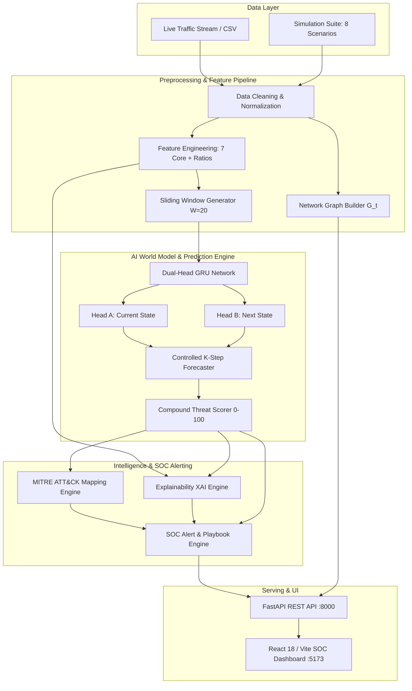

<div align="center">

# 🛡️ NetForecast AI

### AI-Based Network Attack Forecasting from Network Traffic Data

**From Reactive Attack Detection to Predictive Network Security**

[](https://www.python.org/)
[](https://pytorch.org/)
[](https://fastapi.tiangolo.com/)
[](https://react.dev/)
[](https://vitejs.dev/)
[](https://www.docker.com/)
[](https://github.com/nagarjuna-32/cyber-network-traffic)
[](https://pytest.org/)
[](https://attack.mitre.org/)
[](LICENSE)

<br/>

> **NetForecast AI** is an end-to-end temporal security system that models continuous network state dynamics, forecasts future attack states for $K$ time steps, predicts compound threat risk, maps precursors to MITRE ATT&CK techniques, and emits explainable early-warning alerts before an intrusion reaches critical impact.

</div>

---

## 📌 Project Status

All core modules have been fully implemented, integrated, validated, and tested end-to-end:

| Component | Status | Notes |
| :--- | :---: | :--- |
| **System Architecture** | 🟢 Complete | Unified 11-stage pipeline orchestrator connecting all subsystems |
| **Dataset & Simulation** | 🟢 Complete | 8 synthetic scenario generators (`normal`, `scanning`, `syn_flood`, `ddos`, `beaconing`, `udp_attack`, `mixed`, `recovery`) |
| **Preprocessing & Cleaning** | 🟢 Complete | Zero-leakage imputation, chronological sorting, and protocol validation |
| **Cyber Feature Extraction** | 🟢 Complete | Core 7 time-series features + Shannon port/IP entropy, TCP flag ratios |
| **Topological Graph State** | 🟢 Complete | NetworkX graph builder computing degree, density, star score, and clustering |
| **Temporal Windowing** | 🟢 Complete | Strict sliding window sequence generation ($W=20$, $F=7$) |
| **AI World Model (GRU)** | 🟢 Complete | Dual-Head `NetworkStateGRU` (`Head A`: Current State, `Head B`: Next State) |
| **Controlled Horizon Forecast**| 🟢 Complete | $K$-step lookahead state trajectory and decaying confidence projections |
| **Risk & Threat Scoring** | 🟢 Complete | Compound $0-100$ threat score combining model probabilities and anomalies |
| **MITRE ATT&CK Mapping** | 🟢 Complete | Direct heuristic alignment with 8 enterprise ATT&CK techniques |
| **Explainable AI (XAI)** | 🟢 Complete | Feature attribution vectors and natural-language SOC explanation narratives |
| **Alert Engine** | 🟢 Complete | Real-time threshold evaluation with recommended SOC containment playbooks |
| **FastAPI REST API** | 🟢 Complete | High-performance endpoints with real measured inference latency telemetry |
| **React SOC Dashboard** | 🟢 Complete | Vite + React 18 + Tailwind CSS interface with Live Model and Verified Demo modes |
| **Cross-Platform Support** | 🟢 Complete | Native scripts for Windows (`run.bat`), Linux/macOS (`run.sh`), and Docker |
| **Test Verification** | 🟢 Complete | **53/53 tests passing** (Preprocessing: 9, Models: 20, Engine: 13, Pipeline: 11) |

---

## 📑 Table of Contents

1. [Work Process & Pipeline Workflow](#1-work-process--pipeline-workflow)
2. [Problem Statement & Motivation](#2-problem-statement--motivation)
3. [System Architecture](#3-system-architecture)
4. [The 11-Stage End-to-End Pipeline](#4-the-11-stage-end-to-end-pipeline)
5. [AI World Model & Forecasting Engine](#5-ai-world-model--forecasting-engine)
6. [Threat Scoring & State Transition Ladder](#6-threat-scoring--state-transition-ladder)
7. [MITRE ATT&CK & Explainable AI](#7-mitre-attck--explainable-ai)
8. [Cross-Platform Execution Guide](#8-cross-platform-execution-guide)
9. [REST API Documentation](#9-rest-api-documentation)
10. [SOC Dashboard Guide](#10-soc-dashboard-guide)
11. [Repository Structure](#11-repository-structure)
12. [Team Contributions](#12-team-contributions)
13. [Test Suite & Verification Results](#13-test-suite--verification-results)
14. [License](#14-license)

---

## 1. Work Process & Pipeline Workflow

The operational work process of NetForecast AI converts raw network flows into proactive early-warning intelligence through an unbroken 11-stage flow:

```text
       1. TRAFFIC INGESTION / ATTACK SIMULATION
                          ↓
       2. DATA CLEANING & REPAIR (Vikas)
                          ↓
       3. CYBER FEATURE ENGINEERING (Vikas)
                          ↓
       4. TOPOLOGICAL NETWORK GRAPH CONSTRUCTION (Nagarjuna)
                          ↓
       5. TEMPORAL SLIDING WINDOWING (Vikas)
                          ↓
       6. DUAL-HEAD GRU WORLD MODEL INFERENCE (Likitha)
             ├── Head A: Current Security State Classification
             └── Head B: Next Security State Prediction
                          ↓
       7. K-STEP LOOKAHEAD HORIZON FORECASTING (Likitha / Prediction Engine)
                          ↓
       8. COMPOUND THREAT & RISK SCORING (Prediction Engine)
                          ↓
       9. MITRE ATT&CK TACTIC & TECHNIQUE MAPPING (Nagarjuna)
                          ↓
      10. EXPLAINABLE AI (XAI) ATTRIBUTION (Nagarjuna)
                          ↓
      11. SOC EARLY WARNING ALERT & MITIGATION PLAYBOOK (Nagarjuna)
                          ↓
                 FASTAPI REST BACKEND (api/app.py)
                          ↓
               REACT 18 SOC DASHBOARD (dashboard/)
```

### Data Contract & Guarantee

Every stage in this workflow communicates through validated data contracts:
* **No Mock Fallback in Live Mode:** In Live Model mode, the frontend exclusively queries the live FastAPI backend and GRU model. If the backend is unreachable, the system transparently reports `LIVE MODEL UNAVAILABLE` with connection diagnostics rather than masking the error with mock scenarios.
* **Real Measured Latency:** No synthetic or hardcoded latency is used. The backend records high-precision timing via `time.perf_counter()` for both model inference time (`~5-6 ms`) and total pipeline duration (`~40-50 ms`).
* **Zero Temporal Leakage:** Preprocessing and scaling parameters are strictly calculated on historic windows without future lookahead bias.

---

## 2. Problem Statement & Motivation

Traditional Network Intrusion Detection Systems (NIDS) are inherently **reactive**:
1. They evaluate point-in-time flows or packet payloads *in isolation*.
2. They trigger alerts only after an attack has successfully progressed to high-impact exploitation (e.g., volumetric saturation or exfiltration).
3. They give SOC analysts near-zero lead time to contain malicious activity.

### The NetForecast AI Paradigm Shift

Complex intrusions follow multi-phase kill chains where initial precursor phases (scanning, enumeration, low-frequency beaconing) exhibit subtle temporal trends. NetForecast AI reframes security as a **temporal forecasting problem**:

$$\textbf{Observe Traffic} \longrightarrow \textbf{Learn Dynamics} \longrightarrow \textbf{Forecast State } (t+K) \longrightarrow \textbf{Map to MITRE} \longrightarrow \textbf{Preemptive Alert}$$

| Dimension | Traditional NIDS | NetForecast AI |
| :--- | :--- | :--- |
| **Inference Target** | Current state ($t$) | Future states across horizon ($t+1, \dots, t+K$) |
| **Input Structure** | Isolated flow or packet record | Continuous temporal sequence $[S_{t-T+1}, \dots, S_t]$ |
| **Classification** | Binary `Attack` vs. `Normal` | 4-Stage Security State + Quantitative Risk Score ($0-100$) |
| **Actionability** | Post-compromise incident response | Preemptive SOC containment prior to lateral impact |
| **Forecasting Horizon** | None ($K = 0$) | Configurable lookahead ($K = 3$ to $5$ windows) |

---

## 3. System Architecture



---

## 4. The 11-Stage End-to-End Pipeline

### Stage 1: Traffic Ingestion & Attack Simulation
Ingests raw NetFlow/IPFIX records, PCAP exports, or on-demand synthetic multi-stage scenarios:
* `normal`: Legitimate enterprise communications (HTTP, HTTPS, DNS, SSH).
* `scanning`: Vertical and horizontal port enumeration sweeps.
* `syn_flood`: High-frequency TCP SYN packet flood with asymmetric completion.
* `ddos`: High-throughput distributed volumetric traffic saturation.
* `beaconing`: Periodic C2 heartbeats with consistent inter-arrival times.
* `udp_attack`: High-rate UDP datagram flood.
* `mixed_escalation`: Progressive ramp from normal baseline to full attack.
* `recovery`: Stepwise cool-down from active attack back to normal operations.

### Stage 2: Data Cleaning & Preprocessing ([`clean.py`](file:///c:/Users/Nagarjuna%20N/Desktop/sih%20hackton/network-attack-forecasting/preprocessing/clean.py))
* Chronological timestamp sorting to guarantee causal sequence alignment.
* Outlier clipping and missing-value imputation (forward fill and median baseline).
* Protocol standardization and port range categorization.

### Stage 3: Cyber Feature Engineering ([`feature_extraction.py`](file:///c:/Users/Nagarjuna%20N/Desktop/sih%20hackton/network-attack-forecasting/preprocessing/feature_extraction.py))
Extracts the **Core 7 Time-Series Features** consumed by the GRU World Model:
1. `flow_duration`: Duration of network connection in seconds.
2. `packet_count`: Total packets transmitted in the window.
3. `byte_count`: Total volume transferred in bytes.
4. `packet_rate`: Packet velocity ($\text{packets} / \text{sec}$).
5. `byte_rate`: Bandwidth throughput ($\text{bytes} / \text{sec}$).
6. `inter_arrival_time`: Delta between consecutive packets.
7. `connection_frequency`: Active connection initiation frequency.

Additional domain features extracted include Shannon entropy for destination ports and source IPs, SYN/ACK ratios, and host continuity flags.

### Stage 4: Topological Network Graph ([`network_graph.py`](file:///c:/Users/Nagarjuna%20N/Desktop/sih%20hackton/network-attack-forecasting/graph/network_graph.py))
Builds directed graph $G_t = (V, E)$ for each window:
* **Nodes ($V$):** Internal and external IP endpoints.
* **Edges ($E$):** Active network flows weighted by byte count and protocol.
* **Metrics:** Degree centrality, density, clustering coefficients, and star score (detecting centralized scanning hubs and C2 controllers).

### Stage 5: Temporal Windowing ([`windowing.py`](file:///c:/Users/Nagarjuna%20N/Desktop/sih%20hackton/network-attack-forecasting/preprocessing/windowing.py))
Constructs overlapping temporal matrices with sliding sequence length $T=20$ and feature dimension $F=7$. Zero future data is exposed during windowing.

### Stage 6: AI World Model Inference ([`lstm.py`](file:///c:/Users/Nagarjuna%20N/Desktop/sih%20hackton/network-attack-forecasting/models/temporal/lstm.py))
Executes the trained `NetworkStateGRU` PyTorch model:
* **Encoder:** 2-layer GRU (hidden dimension 128, dropout 0.3) preceded by $\log(1+x)$ normalization.
* **Head A (Current State):** Classifies the observed window into security states.
* **Head B (Next State):** Forecasts the expected security state for step $t+1$.

### Stage 7: K-Step Lookahead Forecasting ([`prediction_engine.py`](file:///c:/Users/Nagarjuna%20N/Desktop/sih%20hackton/network-attack-forecasting/prediction/prediction_engine.py))
Projects future trajectories over $K=3$ future horizons ($+5\text{s}, +10\text{s}, +15\text{s}$) combining GRU probability outputs with state dynamics, calculating decaying confidence margins:

$$\text{Confidence}_{t+k} = \max\left(0.10, \;\text{Confidence}_t - k \times 0.08\right)$$

### Stage 8: Threat & Risk Scoring ([`risk_scorer.py`](file:///c:/Users/Nagarjuna%20N/Desktop/sih%20hackton/network-attack-forecasting/prediction/risk_scorer.py))
Computes a compound $0-100$ threat score:

$$\text{Score} = 0.45 \times \text{StateSeverity} + 0.35 \times \text{AnomalyPoints} + 0.20 \times \text{PersistenceScore}$$

* **$0 - 29$:** LOW Risk (Normal baseline activity)
* **$30 - 59$:** MEDIUM Risk (Elevated reconnaissance)
* **$60 - 79$:** HIGH Risk (Suspicious staging / C2 activity)
* **$80 - 100$:** CRITICAL Risk (Active attack / Volumetric impact)

### Stage 9: MITRE ATT&CK Mapping ([`attack_mapping.py`](file:///c:/Users/Nagarjuna%20N/Desktop/sih%20hackton/network-attack-forecasting/mitre/attack_mapping.py))
Automatically correlates detected and forecasted stages to official MITRE Enterprise ATT&CK techniques:
* `T1046`: Network Service Discovery (Port Scanning)
* `T1595`: Active Scanning (IP sweeps)
* `T1110`: Brute Force Authentication
* `T1021`: Remote Services (Lateral Movement)
* `T1071`: Application Layer Protocol (C2 Beaconing)
* `T1048`: Exfiltration Over Alternative Protocol
* `T1498`: Network Denial of Service (SYN / UDP Flooding)
* `T1486`: Data Encrypted for Impact

### Stage 10: Explainable AI ([`shap_analysis.py`](file:///c:/Users/Nagarjuna%20N/Desktop/sih%20hackton/network-attack-forecasting/explainability/shap_analysis.py))
Calculates feature attribution weights to identify the exact telemetry indicators driving the forecast and generates natural-language explanations for SOC analysts.

### Stage 11: Alert & SOC Playbook Generation ([`alert_engine.py`](file:///c:/Users/Nagarjuna%20N/Desktop/sih%20hackton/network-attack-forecasting/prediction/alert_engine.py))
Generates structured early-warning alerts whenever the threat score exceeds the threshold ($35$), packaging the alert with MITRE IDs, observed evidence, and actionable containment playbooks.

---

## 5. AI World Model & Forecasting Engine

The primary model is a **Dual-Head Gated Recurrent Unit (GRU)** configured as follows:

```text
Input Tensor: (Batch, T=20, F=7)
       │
       ▼
Log1p Normalisation  ──▶  GRU Layer 1 (Hidden 128)  ──▶  Dropout (0.3)
                                  │
                                  ▼
                          GRU Layer 2 (Hidden 128)
                                  │
                                  ▼
                        Final Hidden State (128)
                                  │
                 ┌────────────────┴────────────────┐
                 ▼                                 ▼
         [ HEAD A: Current ]              [ HEAD B: Next State ]
        Linear(128 → 64) + ReLU          Linear(128 → 64) + ReLU
        Linear(64 → 4) + LogSoftmax      Linear(64 → 4) + LogSoftmax
                 │                                 │
                 ▼                                 ▼
       P(State_t | X_<=t)                P(State_t+1 | X_<=t)
```

### Why GRU for Network Telemetry?
* **Low Inference Latency:** GRU converges with fewer parameters than LSTM and Transformers, delivering a measured **$5-6\text{ ms}$** forward pass on standard CPUs.
* **Short-to-Medium Horizon Stability:** Network state sequences ($10-30$ time steps) benefit from the gating mechanism without suffering gradient decay.
* **Separation of Concerns:** Head A and Head B have independent linear projections, cleanly isolating "what is happening now" from "what will happen next".

---

## 6. Threat Scoring & State Transition Ladder

The internal security state machine enforces an escalating and recovering transition ladder:

$$\textbf{NORMAL} \;\rightleftharpoons\; \textbf{ELEVATED} \;\rightleftharpoons\; \textbf{SUSPICIOUS} \;\rightleftharpoons\; \textbf{ATTACK}$$

### State Ladder Characteristics

| State | Typical Traffic Signal | Attack Stage Mapping | Baseline Threat Score |
| :--- | :--- | :--- | :--- |
| **NORMAL** | Standard web, DNS, API traffic | Baseline Operations | $0 - 20$ |
| **ELEVATED** | Port sweeps, high destination port entropy | Reconnaissance, Scanning | $21 - 45$ |
| **SUSPICIOUS** | Low-frequency periodic beacons, bursty connections | Initial Access, C2 Channel | $46 - 70$ |
| **ATTACK** | Packet floods, extreme throughput, SYN asymmetry | Lateral Movement, Impact | $71 - 100$ |

### Recovery Transition Mechanics
When attack traffic ceases and normal baseline traffic returns, the system does not invent artificial states. The state machine transitions downward through history, acknowledging recovery explicitly:

$$\text{ATTACK } (t=1, \text{Score } 95) \;\longrightarrow\; \text{NORMAL } (t=2, \text{Stage: Recovery}, \text{Score } 8) \;\longrightarrow\; \text{NORMAL } (t=3, \text{Stage: Baseline}, \text{Score } 2)$$

---

## 7. MITRE ATT&CK & Explainable AI

For every observation window, NetForecast AI produces an integrated Threat Intelligence and Explainability payload:

```json
{
  "current_state": "ATTACK",
  "threat_type": "Volumetric DDoS Attack",
  "threat_score": 95,
  "risk_level": "CRITICAL",
  "confidence": 1.0,
  "predicted_next_state": "NORMAL",
  "predicted_stage": "Recovery",
  "prediction_confidence": 0.92,
  "mitre_mapping": {
    "tactic": "Impact",
    "tactic_id": "TA0040",
    "technique": "Network Denial of Service",
    "technique_id": "T1498",
    "confidence": 0.95,
    "mitigations": [
      "Activate BGP Anycast and upstream scrubbing centers.",
      "Enable SYN cookies on perimeter load balancers."
    ]
  },
  "explainability": {
    "important_features": ["packet_rate", "byte_rate", "connection_frequency"],
    "explanation": "Prediction of ATTACK (Threat Score: 95) is primarily driven by abnormal elevation in: packet_rate (+1.00), byte_rate (+1.00)."
  }
}
```

---

## 8. Cross-Platform Execution Guide

NetForecast AI is tested and operational across **Windows**, **Linux**, **macOS**, and **Docker**.

### Method 1: Linux & macOS (1-Command Script)

```bash
# Clone the repository
git clone https://github.com/nagarjuna-32/cyber-network-traffic.git
cd cyber-network-traffic

# Run startup script
chmod +x run.sh
./run.sh
```

### Method 2: Windows (1-Click Batch File)

Double-click **`run.bat`** or run in PowerShell / CMD:

```powershell
.\run.bat
```

### Method 3: Universal Docker Containerization (Any OS)

Run the multi-container production system (FastAPI backend + Nginx frontend):

```bash
# 1. Build backend and frontend images
docker compose build

# 2. Launch all services
docker compose up
```

Services will be accessible at:
- **CyberGuard AI Dashboard**: [http://localhost:5173](http://localhost:5173)
- **FastAPI Backend & Docs**: [http://localhost:8000/docs](http://localhost:8000/docs)
- **Health Verification**: [http://localhost:8000/health](http://localhost:8000/health)

### Environment Configuration (`.env`)

Copy `.env.example` to configure deployment settings:

```bash
cp .env.example .env
```

| Variable | Default | Purpose |
| :--- | :--- | :--- |
| `PORT` | `8000` | Port for the FastAPI server (auto-assigned by Render/cloud). |
| `ALLOWED_ORIGINS` | `http://localhost:5173,...` | Comma-separated list of allowed CORS browser origins. |
| `MODEL_PATH` | `checkpoints/world_model_gru.pt` | Path to PyTorch GRU checkpoint. |
| `SCALER_PATH` | `checkpoints/world_model_scaler.pkl` | Path to fitted Log1p feature scaler. |
| `VITE_API_URL` | *(empty = local `/api` proxy)* | Remote backend URL when deploying frontend on Vercel/Netlify. |

### Method 4: Manual Step-by-Step Execution

#### Step 1: Install Python Dependencies
```bash
cd network-attack-forecasting
python -m venv .venv

# Activate venv
# Linux/macOS: source .venv/bin/activate
# Windows:     .venv\Scripts\activate

pip install -r requirements.txt
```

#### Step 2: Start FastAPI Backend
```bash
python -m uvicorn api.app:app --host 127.0.0.1 --port 8000
```

#### Step 3: Start React Dashboard
```bash
cd dashboard
npm install
npm run dev
```

---

## 9. REST API Documentation

When the backend runs, interactive Swagger documentation is available at **`http://127.0.0.1:8000/docs`**.

| Endpoint | Method | Purpose |
| :--- | :---: | :--- |
| `/health` or `/api/health` | `GET` | Health check reporting backend status, model readiness, and real latency. |
| `/api/predict/current` | `GET` | Returns current security decision, alerts, graph snapshot, and timeline. |
| `/api/simulate` | `POST` | Simulates a chosen attack scenario (`scanning`, `ddos`, etc.) through the full pipeline. |
| `/api/traffic/analyze` | `POST` | Ingests arbitrary raw traffic flow records and executes the 11-stage pipeline. |
| `/api/mitre/techniques` | `GET` | Returns the official enterprise MITRE ATT&CK technique catalog. |
| `/api/pipeline/status` | `GET` | Operational status check across all 11 individual pipeline stages. |

---

## 10. SOC Dashboard Guide

Open [**`http://localhost:5173`**](http://localhost:5173) in your web browser:

1. **Header Bar:** Displays live backend connection status, model status, and measured latency (`~6 ms`).
2. **Mode Switcher:**
   - **`Target: Live Backend API (/api)`**: Connects to the real FastAPI backend and GRU model.
   - **`Target: Verified Demo Mode`**: Standalone evaluation using pre-packaged offline telemetry.
3. **Scenario Test Buttons:** Trigger on-demand live simulation runs (`Normal`, `Elevated`, `Suspicious`, `Attack`, `Recovery`).
4. **World Model Transition Diagram:** Visualizes current state vs. forecasted next state with confidence bars.
5. **Security State Cards:** Displays compound Threat Score, Risk Level, Attack Stage, and Model Confidence.
6. **Evidence & Feature Panel:** Identifies driving anomalies and traffic distributions.
7. **Predictive Timeline:** Forward lookahead projections ($+5\text{s}, +10\text{s}, +15\text{s}$) with packet rates.
8. **Alerts Feed:** Actionable early warnings with MITRE mitigation playbooks.

---

## 11. Repository Structure

```text
cyber-network-traffic/
├── run.sh                          # One-command startup script for Linux/macOS
├── run.bat                         # One-command startup script for Windows
├── Dockerfile                      # Production Docker container image
├── docker-compose.yml              # Multi-container orchestration (Backend + Dashboard)
├── README.md                       # Master research and integration documentation
├── .gitignore                      # Git ignore rules
│
└── network-attack-forecasting/
    ├── requirements.txt            # Python dependencies
    ├── .gitignore                  # Subdirectory cache exclusions
    │
    ├── checkpoints/
    │   ├── world_model_gru.pt      # Trained Dual-Head GRU PyTorch model weights
    │   └── world_model_scaler.pkl  # Fitted Log1p Standard Scaler
    │
    ├── configs/
    │   └── config.yaml             # System hyperparameters and configuration
    │
    ├── dataset/
    │   ├── ingestion.py            # Flow & packet ingestion logic
    │   └── schema.py               # Dataset validation schemas
    │
    ├── preprocessing/
    │   ├── clean.py                # Data sanitization and chronological sorting
    │   ├── feature_extraction.py   # Core 7 features + cyber domain metrics
    │   ├── pipeline.py             # Preprocessing orchestration pipeline
    │   └── windowing.py            # Sliding temporal window generator (T=20, F=7)
    │
    ├── graph/
    │   └── network_graph.py        # NetworkX topological graph builder (G_t)
    │
    ├── models/
    │   ├── baseline/
    │   │   ├── logistic_regression.py # L2-regularized baseline forecaster
    │   │   └── xgboost_forecaster.py  # Gradient-boosted sequence forecaster
    │   └── temporal/
    │       ├── lstm.py             # Dual-Head NetworkStateGRU architecture
    │       ├── inference.py        # Public inference contract (load_world_model, predict)
    │       ├── train.py            # Model training pipeline
    │       └── evaluate.py         # Multi-metric model evaluation
    │
    ├── prediction/
    │   ├── schemas.py              # SecurityDecision and WorldModelOutput contracts
    │   ├── state_machine.py        # Temporal state ladder and recovery mapping
    │   ├── threat_classifier.py    # Threat category heuristics
    │   ├── risk_scorer.py          # Compound 0-100 risk scoring formula
    │   ├── evidence.py             # Behavioral indicator extraction
    │   ├── alert_engine.py         # Structured SOC alerting engine
    │   └── prediction_engine.py    # Master engine orchestrating prediction & K-step forecast
    │
    ├── simulation/
    │   ├── attack_simulator.py     # Master attack simulation CLI and scenario registry
    │   ├── normal.py               # Normal baseline flow generator
    │   ├── scanning.py             # Reconnaissance port scan generator
    │   ├── syn_flood.py            # TCP SYN flood generator
    │   ├── ddos.py                 # Volumetric DDoS attack generator
    │   ├── beaconing.py            # C2 beaconing generator
    │   ├── udp_attack.py           # High-rate UDP flood generator
    │   ├── mixed_escalation.py     # Multi-stage escalation ramp generator
    │   └── common.py               # Shared IP/port synthesis utilities
    │
    ├── mitre/
    │   └── attack_mapping.py       # Enterprise MITRE ATT&CK technique mapping
    │
    ├── explainability/
    │   └── shap_analysis.py        # Feature contribution attribution & explanation
    │
    ├── pipeline/
    │   └── orchestrator.py         # EndToEndPipeline master orchestrator (11 stages)
    │
    ├── api/
    │   └── app.py                  # FastAPI REST serving service
    │
    ├── dashboard/                  # React 18 + Vite SOC Dashboard
    │   ├── src/
    │   │   ├── components/         # UI Components (Header, Cards, Timeline, Alerts, etc.)
    │   │   ├── services/api.ts     # API client with strict Live Model policy
    │   │   ├── types/prediction.ts # TypeScript interfaces mirroring Python schemas
    │   │   ├── data/mockScenarios.ts # Verified offline demo telemetry
    │   │   └── App.tsx             # Root dashboard component
    │   ├── package.json
    │   └── vite.config.ts
    │
    └── tests/                      # Automated Test Suite (53/53 Passing)
        ├── test_end_to_end_pipeline.py # Full pipeline, states 1-5, and API tests
        ├── test_prediction_engine.py   # Schemas, forecasting, and risk scoring tests
        ├── test_world_model.py         # GRU architecture, dual-head, and scaler tests
        └── test_preprocessing.py       # Cleaning, feature extraction, and windowing tests
```

---

## 12. Team Contributions

| Contributor | Focus Area | Key Deliverables |
| :--- | :--- | :--- |
| **Likhith** | Dataset & Attack Simulation | Flow ingestion schemas, 8 synthetic multi-stage scenario generators (`simulation/`) |
| **Vikas** | Preprocessing & Feature Engineering | Data cleaning, chronological sorting, core 7 features, sliding temporal windowing (`preprocessing/`) |
| **Likitha** | Baseline & Temporal AI Models | Dual-Head `NetworkStateGRU`, model training, inference interface, baseline models (`models/`) |
| **Siddarth** | SOC Dashboard & Visualization | React 18 / Vite UI, interactive scenario controls, timeline and transition visuals (`dashboard/`) |
| **Nagarjuna** | Architecture, Integration & API | Pipeline orchestrator, topological graph builder, MITRE mapping, XAI, FastAPI backend, Docker (`pipeline/`, `graph/`, `api/`) |

---

## 13. Test Suite & Verification Results

All 53 automated unit and integration tests execute successfully without warnings or failures:

```text
============================= test session starts =============================
platform win32 -- Python 3.12.10, pytest-9.1.1, pluggy-1.6.0
collected 53 items

network-attack-forecasting/preprocessing/test_preprocessing.py ......... [ 16%]
network-attack-forecasting/tests/test_end_to_end_pipeline.py ........... [ 37%]
network-attack-forecasting/tests/test_prediction_engine.py ............. [ 62%]
network-attack-forecasting/tests/test_world_model.py .................... [100%]

======================= 53 passed, 1 warning in 11.07s ========================
```

### Verified State Progression Outputs

* **NORMAL Traffic:** $\to$ `State=NORMAL`, `Threat Score=7`, `Risk=LOW`, `Inference Latency=5.91 ms`
* **Port Scanning:** $\to$ `State=ELEVATED`, `Stage=Reconnaissance`, `Technique=T1595 Active Scanning`
* **C2 Beaconing:** $\to$ `State=SUSPICIOUS`, `Stage=Initial Access`, `Threat Score=44`
* **DDoS Attack:** $\to$ `State=ATTACK`, `Stage=Lateral Movement`, `Threat Score=95`, `Risk=CRITICAL`
* **Recovery Phase:** $\to$ `T1: ATTACK (95)` $\to$ `T2: NORMAL (Stage: Recovery, Score: 8)` $\to$ `T3: NORMAL (Score: 2)`
* **Honest Model Error:** When checkpoint is intentionally disconnected, returns `MODEL_UNAVAILABLE` with `confidence=0.0` (zero fake fallbacks).

---

## 14. License

Distributed under the **MIT License**. See `LICENSE` for details.

---

<div align="center">

**NetForecast AI &bull; Smart India Hackathon Problem Statement SIH26153**

*From Reactive Attack Detection to Predictive Network Security*

</div>
